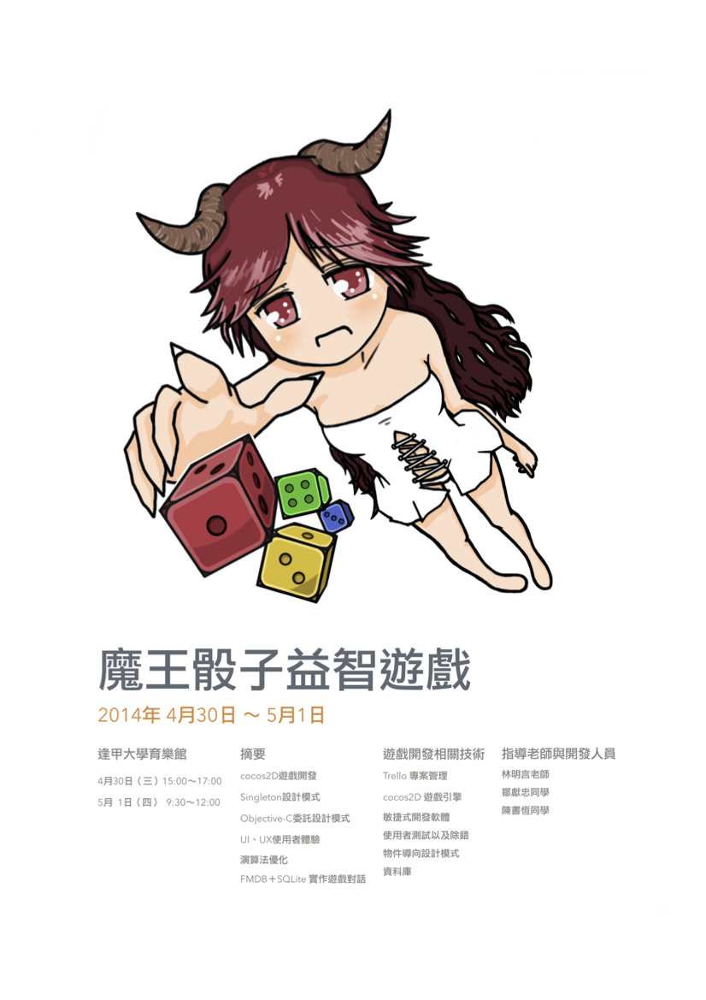

# 2014 年逢甲大學資工系畢業專題 （ iOS 魔王骰子益智遊戲 ）

>這個專案是大學的時候的畢業專題，從 2011 年自學 Objective-C 開始，然後學到 OpenGL ES ，後來於 2012 年初轉到 cocos2d for iPhone ，2012 年暑假開始撰寫此專題，最後於 2013 年十一月發表，並且於 2014 年校內專題競賽拿下佳獎、以及聯合專題競賽的數位娛樂類的第一名，裡面用到比較有趣的技術是把角色對話用成 Database 的形式（SQLite），讓角色有各種個性、對話、以及衣服、表情，讓使用者可以有同樣的 NPC 但是不同的個性、對話、衣著（但目前只有建立傲嬌系的部分，且關聯式資料庫存取沒有模組化、或是用第三方 Framework 來處理（笑）），以及會以使用者目前的檔案資料知道該開啟哪種模式（如新手教學或是一般模式等），這個專題目前是可以玩的，有興趣的人可以下載來玩玩看。

# 競賽海報：

### 第三方 Framework
- [FMDB][]

### License

OldDemonDice is available under the MIT license.

[FMDB]: https://github.com/ccgus/fmdb
